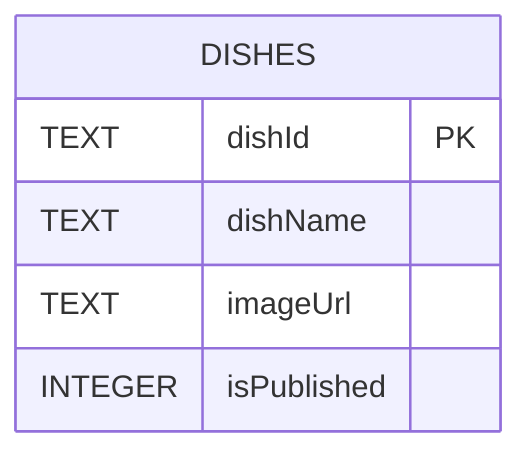
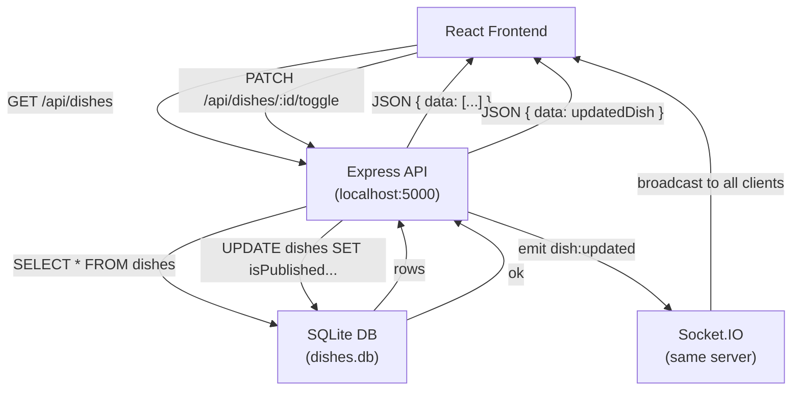
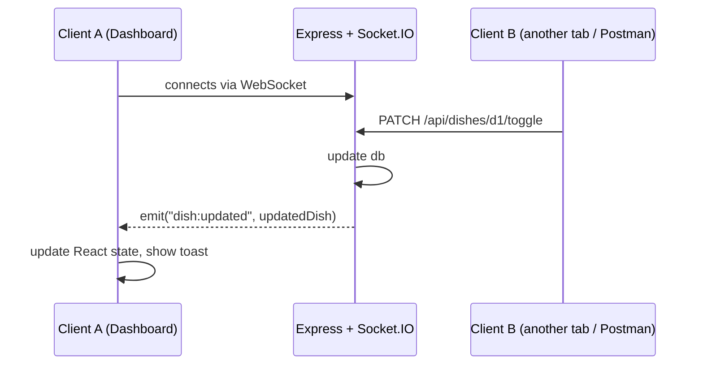

# ERD and API Structure

## Database Schema

Note: SQLite doesn't have a native boolean type so `isPublished` is stored as `0` or `1` and converted to `true/false` by the API before sending to the client.

---

## API Flow

---

## Real-Time Update Flow (Bonus)

